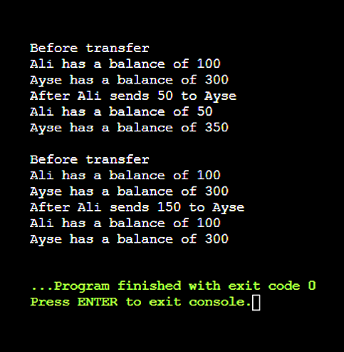
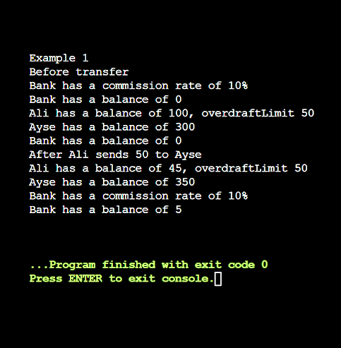
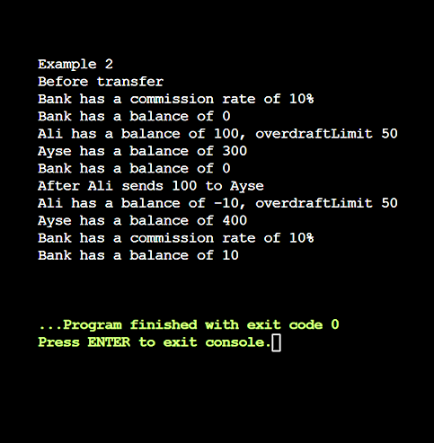
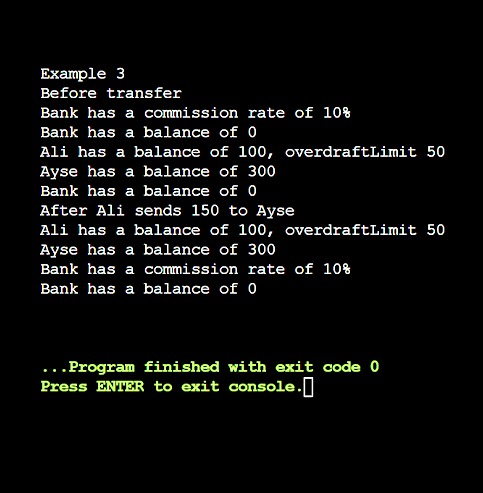

# OOP-Bank-System

A robust Java-based banking simulation demonstrating core Object-Oriented Programming (OOP) principles, including inheritance, method overriding, encapsulation, and transaction processing.


## Features

✅ **Encapsulation & Data Protection:** Secures account balances and properties using proper access modifiers.  
✅ **Dynamic Fund Transfers:** Handles money transfers between accounts with validation checks for sufficient balances and positive amounts.  
✅ **Object-Oriented Hierarchy:** Implements inheritance structures extending foundational account logic into specialized types.  
✅ **Overdraft Management:** Supports advanced account rules like checking accounts with custom withdrawal limits.  
✅ **Commission Processing:** Features specialized banking logic to calculate and accumulate service fees on transactions.  
✅ **Written in Pure Java:** Utilizes standard library operations for clean execution and performance.


## Project Structure
```
OOP-Bank-System
├── assets
│   ├── output-v1.png
│   └── output-v2.png
|
├── v1-basic-bank
│   ├── Bank.java
│   ├── BankAccount.java
│   └── Main.java
│
├── v2-advanced-bank
│   ├── Bank.java
│   ├── BankAccount.java
│   ├── CheckingAccount.java
│   ├── CommissionBank.java
│   └── Main.java
│
├── README.md
└── LICENSE
```

## Screenshots

|Output v1|Output v2 (exm1)|
|---|---|
||  |

|Output v2 (exm2)|Output v2 (exm3)|
|---|---|
||  |


## How It Works

1. Create bank accounts with unique IDs and initial balances.
2. Perform deposits and withdrawals with validation.
3. Transfer funds securely between accounts.
4. Demonstrate inheritance and polymorphism through specialized account types.
5. Apply overdraft and commission rules in the advanced version.

## 📥 Cloning the Repository

To get started, clone this repository using Git:
```bash
git clone https://github.com/ALAADROID/OOP-Bank-System.git  
cd OOP-Bank-System
```

### 🛠️ Compilation
To compile the program using a standard Java compiler (javac), navigate to your desired version folder and run:

```bash
javac *.java
```

## 🚀 Running the Program
After compiling, execute the main class via your console:
```bash
java Main
```

## 📌 Notes
Ensure you have Java Development Kit (JDK) installed on your system to compile and execute the program.  

The project is split into versions representing progressive object-oriented design steps, from basic account transfers to extended financial institutions and rules.  

---

**Developed by [ALAADROID](https://github.com/ALAADROID)**
